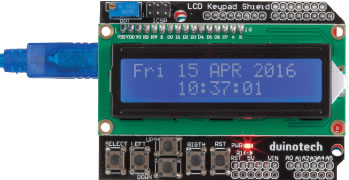
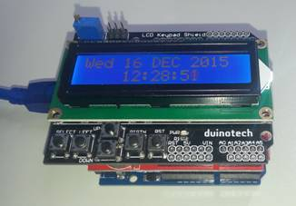

## LCD Arduino Clock

This is an easy project to assemble- just one main board and  two shields, but gives a fully functional, easy to read clock display which  retains the time, even when disconnected from power. You could leave it on your  desk plugged into a USB port on your computer, so that it powers up whenever  the computer is on.

## Components

|Qty| Code | Description |
|---|---|---|
|1 | [XC4410](http://jaycar.com.au/p/XC4410) | uno main board
|1 | [XC4536](http://jaycar.com.au/p/XC4536) | datalogging shield
|1 | [XC4454](http://jaycar.com.au/p/XC4454) | LCD shield

## Connections

All the connections are made with interconnects on the  shield, but the following are the important pins:

|Pin | Function
| --- | ---
| A4(SDA) |12C Data
|A5(SCL) |12C Clock
|D10 |SD Card Select
|D11 |Master In Slave Out
|D12 |Master Out Slave In
|D13 |Serial Clock
|A0 | Pushbuttons
|D4 | LCD Data bit0 (in 4bit mode)
|D5 | LCD Data bit1 (in 4bit mode)
|D6 | LCD Data bit2 (in 4bit mode)
|D7 | LCD Data bit3 (in 4bit mode)
|D8 | LCD Register select
|D9 | LCD Enable

Stack the shields, first the Data Log Shield onto the Uno,  then the LCD Shield onto the Data Log Shield. Make sure you’ve got the RTClib  Library installed. The project also uses the Wire and LCD libraries, but they  are included with the Arduino IDE.

Compile and upload the code to the board, and the clock  should display a time and date (which probably isn’t right). The clock can be  adjusted by pressing select, then left and right to choose which field to edit,  and up and down to adjust the field. The seconds can only be set to zero rather  than adjusted up or down. Press select again to return to clock mode.

## Improvements

With the addition of a buzzer module, the code could be  modified to act as an alarm clock. Once the clock is set, the sketch on the  main board can be changed, so the buttons could be reprogrammed to operate  different functions, such as a countdown timer.
